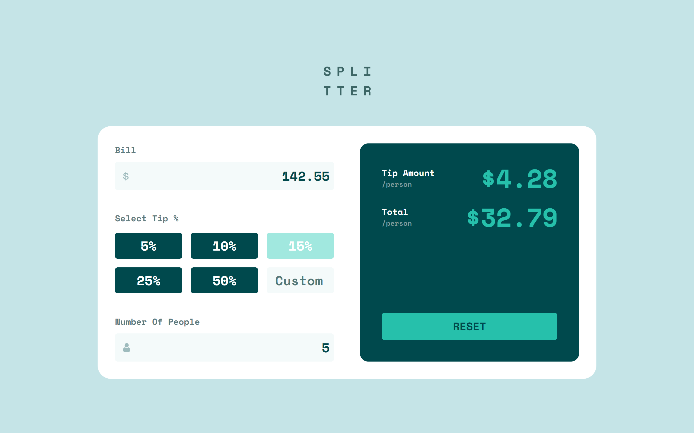

# Frontend Mentor - Tip calculator app solution

This is a solution to the [Tip calculator app challenge on Frontend Mentor](https://www.frontendmentor.io/challenges/tip-calculator-app-ugJNGbJUX). Frontend Mentor challenges help you improve your coding skills by building realistic projects.

## Table of contents

-   [Overview](#overview)
    -   [The challenge](#the-challenge)
    -   [Screenshot](#screenshot)
    -   [Links](#links)
-   [My process](#my-process)
    -   [Built with](#built-with)
    -   [What I learned](#what-i-learned)
-   [Author](#author)

## Overview

### The challenge

Users should be able to:

-   View the optimal layout for the app depending on their device's screen size
-   See hover states for all interactive elements on the page
-   Calculate the correct tip and total cost of the bill per person

### Screenshot

### Links

-   Solution URL: [Solution URL ](https://github.com/Andro87/tip-calculator-app.git)
-   Live Site URL: [Live site URL ](https://tip-calculator-app-tau-eight.vercel.app/)

## My process

### Built with

-   Semantic HTML5 markup
-   SCSS / SASS
-   Flexbox
-   CSS Grid
-   Mobile-first workflow
-   [React](https://reactjs.org/) - JS library
-   [Next.js](https://nextjs.org/) - React framework

### What I learned

The challenge allowed me to continue improving my knowledge of React and its hooks.
The main difficulties have focused on settling the logic for accepting the correct number input and the functionalities linked to them.
There are also aspects of the project that require some reviews, which I look forward to improving and developing.

## Author

-   Frontend Mentor - [@Andro87](https://www.frontendmentor.io/profile/Andro87)
